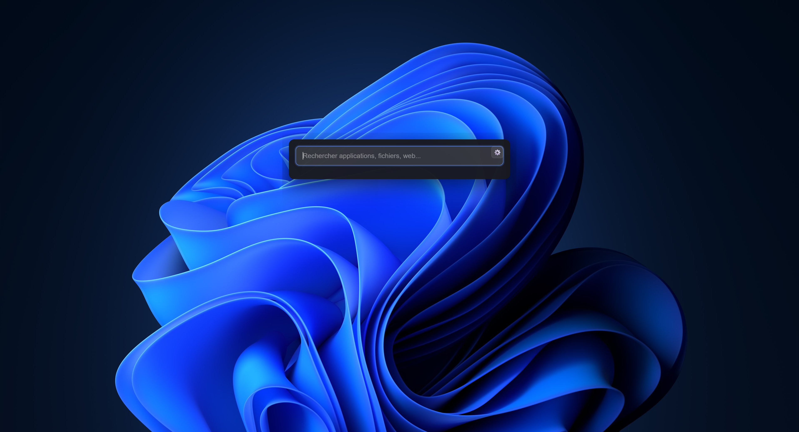

# 🔍 Spotlight for Windows

A sleek, modern search bar for Windows inspired by macOS Spotlight. Built with Electron for lightning-fast system-wide search.


## ✨ Features

- **🚀 Global Hotkey**: Instantly accessible with `Ctrl + Alt + Space`
- **⚡ Real-time Search**: Results update as you type
- **⌨️ Keyboard Navigation**: Navigate through results with arrow keys
- **🎨 Modern UI**: Beautiful, transparent interface with blur effects
- **🪶 Lightweight**: Minimal resource footprint
- **🎯 Always on Top**: Appears over any application

## 📸 Screenshots



## 🚀 Quick Start

### Prerequisites

- Node.js (v16 or higher)
- npm or yarn
- Windows 10/11

### Installation
```bash
# Clone the repository
git clone https://github.com/kylianjoff/spotlight-for-windows.git

# Navigate to project directory
cd spotlight-for-windows

# Install dependencies
npm install

# Run the application
npm start
```

## 🎮 Usage

1. **Launch the app**: Run `npm start`
2. **Open search bar**: Press `Ctrl + Alt + Space` anywhere in your system
3. **Type to search**: Start typing to see real-time results
4. **Navigate**: Use `↑` `↓` arrow keys to move through results
5. **Select**: Press `Enter` to open the selected item
6. **Close**: Press `Esc` or click outside the window

## 🛠️ Built With

- **[Electron](https://www.electronjs.org/)** - Cross-platform desktop apps
- **HTML5/CSS3** - Modern, responsive interface
- **JavaScript** - Application logic
- **Node.js** - File system operations and system integration

## 📋 Roadmap

- [x] Basic search interface
- [x] Global hotkey registration
- [x] Keyboard navigation
- [x] File system indexing
- [x] Application launcher
- [x] Web search integration
- [x] Fuzzy search with [fuse.js](https://fusejs.io/)
- [ ] Custom themes
- [ ] Custom hotkey configuration
- [x] Settings panel
- [ ] File preview
- [ ] Calculator functionality
- [ ] Recent searches history
- [x] Multi languages system (only english and french)
- [ ] More language support

## ⚙️ Configuration

The application can be configured by modifying `main.js`:
```javascript
// Change the global hotkey
globalShortcut.register('CommandOrControl+Alt+Space', () => { ... })

// Adjust window size
width: 600,
height: 400,

// Enable/disable transparency
transparent: true,
```

## 🤝 Contributing

This project is currently closed to contributions.

## 📝 Project Structure
```
mon-spotlight/
├── main.js              # Electron main process
├── preload.js           # Preload script (security bridge)
├── search.js            # Search script
├── package.json         # Project dependencies
├── src/
│   ├── index.html       # Application UI
│   ├── renderer.js      # Frontend logic
│   └── styles.css       # Styling
└── README.md
```

## 🐛 Known Issues

- Icon extraction may take a few seconds for 100+ apps on first launch
- Some Microsoft Store apps may not display icons due to Windows permissions
- Network service error in console (non-critical, does not affect functionality)

## 💡 Inspiration

This project was inspired by:
- **macOS Spotlight** - The original system-wide search
- **Alfred** - Powerful productivity app for macOS
- **Wox** - Open-source launcher for Windows

## 📄 License

This project is licensed under the MIT License - see the [LICENSE](LICENSE) file for details.

## 👤 Author

**Kylian JULIA** Engineering Student in Computer Science at INP ISIMA
- Website: [kylianjulia.fr](https://kylianjulia.fr)
- GitHub: [@kylianjoff](https://github.com/kylianjoff)
- Project Link: [https://github.com/kylianjoff/spotlight-for-windows](https://github.com/kylianjoff/spotlight-for-windows)

## 🙏 Acknowledgments

- Electron community for excellent documentation
- The open-source community for inspiration and tools
- Everyone who contributes to making Windows more productive

---

<p align="center">
  Made with ❤️ and ☕
</p>

<p align="center">
  ⭐ Star this repo if you find it useful!
</p>